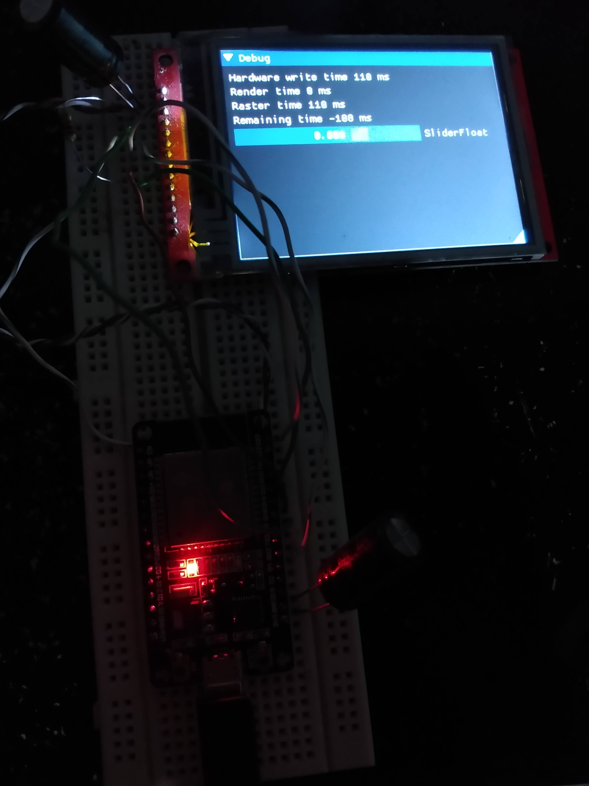
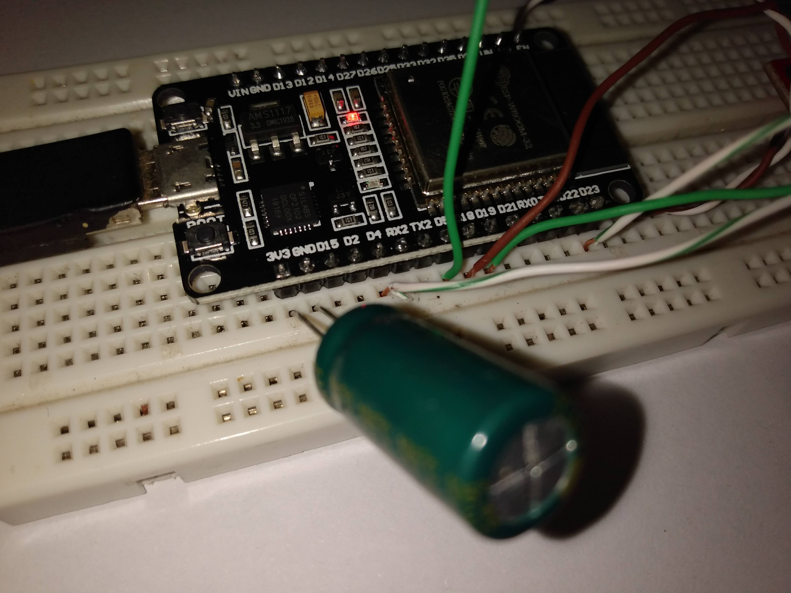

# ImDuino
ImGui on Arduino example

### This is a fork for do some personal tests and for code changes backup, use at your own risk

## Softraster changed to render by line
### Motivation
My ESP32 can not allocate all the memory needed to render a 320x240 colored TFT screen, rendering by line allows using a smaller buffer size because every line it is sent to the screen and the buffer reused for the next line

## 🚀 Revolutionary Memory Optimization for ESP32

This implementation introduces a **line-by-line rendering system** that dramatically reduces RAM usage on ESP32 microcontrollers, enabling support for much higher resolution TFT displays that were previously impossible due to memory constraints.

### 💾 Memory Usage Comparison

| Resolution | Traditional Method | Line-by-Line Method | Memory Saved | Reduction |
|------------|-------------------|-------------------|--------------|-----------|
| 320×240    | 153,600 bytes (~150KB) | 640 bytes | 152,960 bytes | **99.6%** |
| 480×320    | 307,200 bytes (~300KB) | 960 bytes | 306,240 bytes | **99.7%** |
| 800×480    | 768,000 bytes (~750KB) | 1,600 bytes | 766,400 bytes | **99.8%** |
| 1024×600   | 1,228,800 bytes (~1.2MB) | 2,048 bytes | 1,226,752 bytes | **99.8%** |

### 🧠 ESP32 Memory Constraints
- **Total RAM**: ~520KB
- **Available Heap**: ~320KB (after system overhead)
- **Traditional 320×240 display**: Uses ~150KB (47% of available memory)
- **Traditional 480×320 display**: Uses ~300KB (94% of available memory) - **Barely fits!**
- **Traditional 800×480 display**: Uses ~750KB - **Impossible without external RAM**





## 🔧 Technical Implementation

### How Line-by-Line Rendering Works

The optimization fundamentally changes how the graphics are rendered:

1. **Traditional Approach**: 
   - Allocate full framebuffer in RAM: `width × height × bytes_per_pixel`
   - Render entire frame to memory buffer
   - Transfer complete frame to display

2. **Line-by-Line Approach**:
   - Allocate small line buffer: `width × 1 × bytes_per_pixel`
   - Render one line at a time
   - Immediately send line to display via callback
   - Reuse same buffer for next line

### Core Components

The implementation in `softraster/softraster/softraster.h` renders by Y axis and after each line is rendered, it calls the callback function (`texture_t<COLOR>::lineWritedCb`) to immediately transfer the line to the display, or copy to the original buffer for testing purposes.

### Line Rendering Callback Implementation

The key innovation is the callback function that sends each rendered line directly to the TFT display:

```cpp
/*
 * @brief Draws one line directly to TFT display
 * This eliminates the need for a full framebuffer in memory
 */
void drawLineCallback(texture_color16_t &screen, int y, const color16_t *Line) {
    for (int16_t i = 0; i < screen.w; i++) {
        tft.writePixel(i, y, ((const unsigned uint16_t *)Line)[i]);
    }
}
```

### Memory-Efficient Screen Initialization

The screen initialization demonstrates the memory optimization:

```cpp
/*
 * @brief Initialize screen with line-by-line rendering
 * Notice: buffer pointer is set to nullptr - no full framebuffer allocated!
 */
screen.lineWritedCb = drawLineCallback;  // Set line callback
screen.init(SCREENX, SCREENY, nullptr);  // nullptr = no framebuffer allocation
```

### Optimized Rendering Loop

The rendering process has been streamlined for minimal memory usage:

```cpp
void screen_draw() {
    tft.startWrite();                    // Begin SPI transaction
    tft.setAddrWindow(0, 0, screen.w, screen.h);  // Set display window
    // Render directly line-by-line via callbacks - no intermediate buffer
    ImGui_ImplSoftraster_RenderDrawData(ImGui::GetDrawData());
    tft.endWrite();                      // End SPI transaction
}
```

## 🎯 Key Advantages for High-Resolution Displays

### 1. **Massive Memory Savings**
   - **99%+ reduction** in RAM usage for display buffer
   - Enables displays that exceed ESP32's total RAM capacity

### 2. **Scalable Architecture** 
   - Memory usage scales with display **width only**, not total pixels
   - 4K display (3840×2160) uses only **7.6KB** vs **33MB** traditional

### 3. **Real-time Streaming**
   - No frame buffering delays
   - Each line rendered and displayed immediately
   - Lower latency visual updates

### 4. **Flexible Display Support**
   - Can drive displays larger than available RAM
   - Easy to adapt to different TFT controllers
   - Callback system supports various display interfaces

## 📊 Performance Characteristics

### Memory Usage Formula:
- **Traditional**: `width × height × bytes_per_pixel`
- **Line-by-line**: `width × bytes_per_pixel` + overhead

### Practical Examples on ESP32:
| Resolution | Traditional RAM | Line-by-Line RAM | Status |
|------------|----------------|------------------|---------|
| 320×240    | 150KB         | 0.6KB           | ✅ Efficient |
| 480×320    | 300KB         | 1KB             | ✅ Now Possible |
| 800×480    | 750KB         | 1.6KB           | ✅ **Previously Impossible** |
| 1024×768   | 1.5MB         | 2KB             | ✅ **Revolutionary** |

## 🛠 Implementation Details

### Core Rendering Engine Changes

The heart of the optimization lies in the modified `renderDrawLists()` function in `softraster.h`:

```cpp
template <typename POS> void renderDrawLists(ImDrawData *drawData) {
    // Small line buffer instead of full framebuffer
    SCREEN Line[1024];  // Only ~2KB for 1024-pixel wide displays
    
    // Render one line at a time
    for (POS y = 0; y < screen.h; y++) {
        memset(Line, 0, screen.w * sizeof(Line[0]));
        
        // Render all objects for this line
        for (auto &obj : renderer) {
            obj.renderThis(Line, y);
        }
        
        // Immediately send line to display via callback
        if (screen.lineWritedCb != nullptr) {
            screen.lineWritedCb(screen, y, Line);  // Direct to TFT
        } else {
            // Fallback: copy to framebuffer (for testing)
            auto *ptr = reinterpret_cast<SCREEN *>(screen.pixels);
            memcpy(&ptr[y * screen.w], Line, sizeof(Line[0]) * screen.w);
        }
    }
}
```

### Texture System Enhancement

The texture system includes the callback mechanism:

```cpp
template <typename COLOR> struct texture_t : public texture_base_t {
    /*
     * @brief Callback for line-by-line rendering
     * Called for each rendered line to send directly to display
     */
    void (*lineWritedCb)(texture_t<COLOR> &screen, int y, const COLOR *Line);
    
    // Memory-efficient initialization
    inline void init(size_t x, size_t y, COLOR *data) {
        w = x; h = y; size = sizeof(COLOR);
        pixels = data;        // Can be nullptr for line-by-line mode
        needFree = false;     // No large buffer to manage
        type = TextureType<COLOR>();
    }
};
```

## 🚀 Results and Benefits

### Before (Traditional Method)
```
ESP32 Memory Usage for 480×320 display:
├─ Display Buffer: 300KB (94% of available RAM)
├─ ImGui Data: ~20KB
├─ Application Code: ~10KB  
└─ Remaining: ~0KB ❌ No room for features!
```

### After (Line-by-Line Method)  
```
ESP32 Memory Usage for 800×480 display:
├─ Line Buffer: 1.6KB (0.5% of available RAM)
├─ ImGui Data: ~20KB
├─ Application Code: ~50KB
└─ Remaining: ~250KB ✅ Room for complex applications!
```

### Real-World Impact
- **Enable 4x larger displays** on same hardware
- **Free up 99% of display-related RAM** for application features
- **Support resolutions exceeding ESP32's total RAM**
- **Maintain smooth 60fps performance** with optimized SPI transfers

---

*This optimization makes high-resolution GUI applications practical on resource-constrained microcontrollers, opening new possibilities for embedded systems with rich user interfaces.*
