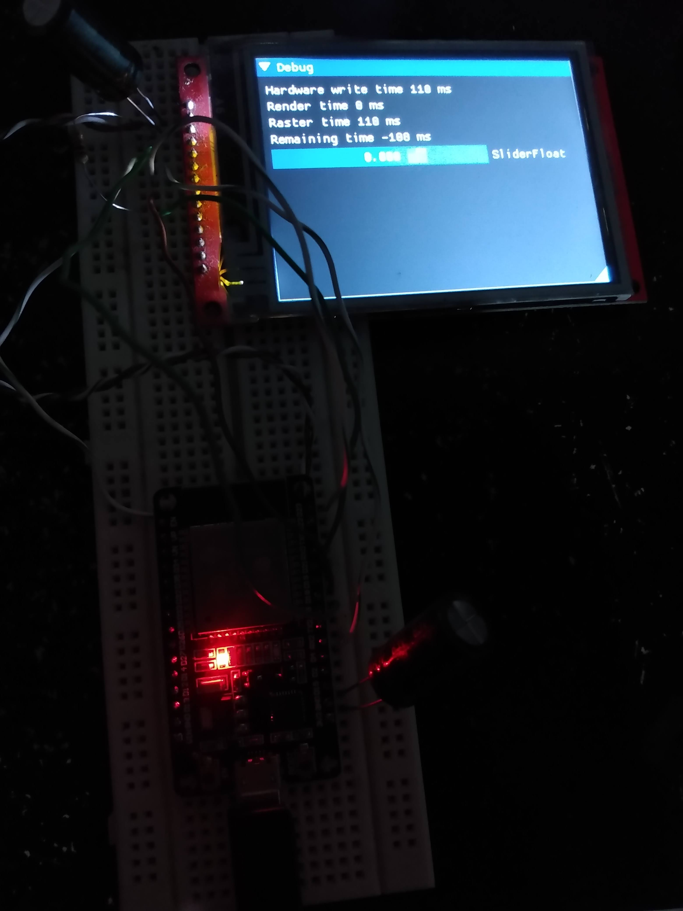

# ImDuino
ImGui on Arduino example

### This is a fork for do some personal tests and for code changes backup, use at your own risk

## Softraster changed to render by line
### Motivation
My ESP32 can not allocate all the memory needed to render a 320x240 colored TFT screen, rendering by line allows using a smaller buffer size because every line it is sent to the screen and the buffer reused for the next line




The code on softraster/softraster/softraster.h is rendering by Y axis and after the line is rendered it will call the callback function (`texture_t<COLOR>::lineWritedCb`) or copy to the original buffer (for some testing purposes)

Draw line on the TFT screen callback
```cpp
/*
 * @brief Draws one line
 */
void drawLineCallback(texture_color16_t &screen, int y, color16_t *Line) {
    for (int16_t i = 0; i < screen.w; i++) {
        tft.writePixel(i, y, ((const unsigned uint16_t *)Line)[i]);
    }
}
```

Screen init changed
```cpp
    /*
     * @brief callback for draw one line
     */
    screen.lineWritedCb = drawLineCallback;

    screen.init(SCREENX, SCREENY, nullptr); // Sets the raster buffer as nullptr
```

Screen draw was modified to:
```cpp

void screen_draw() {
    tft.startWrite();
    ImGui_ImplSoftraster_RenderDrawData(ImGui::GetDrawData());
    tft.endWrite();
}

```
